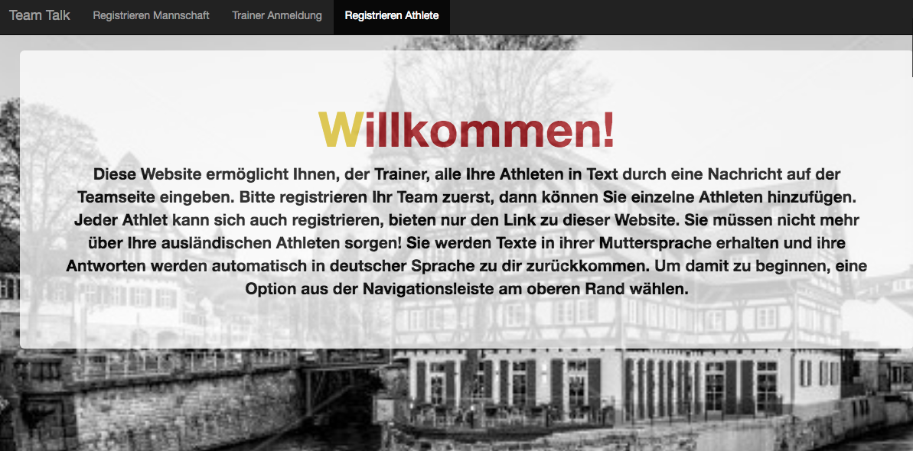

## About

TeamTalk is an international team messaging application:

As the only foreign shooter for a German Bundesliga team, I often received messages from my coaches that were entirely in German. And since they were often in the 60-80 year demographic, communication wasn’t always easy: while I could translate their messages, it was hard for them to do the same when I responded since they weren’t comfortable with technology. 

My application takes the complication out of this process by giving them a platform they can type directly in to on a website instead of having to navigate a touch-screen smartphone. The message they send is automatically translated to non-German speaking team members. Then, responses to the coach are translated automatically back to German. 

The coaches are given a single Twilio number to text (or they can also type directly on a website), and  receive messages there. That’s all they see to keep their exposure to technology minimal. This number or website communicates to a team list which is maintained separately from the Twilio phone number, so that the coach does not have the added responsibility for keeping track of the whole list of numbers. 

After the coach types a message and hits the send button on their team home pages, Twilio texts each number on the team list. If an athlete has registered a non-German language, Google translate jumps in and changes the message for that specific athlete. When an athlete texts a non-German response, which is recognized by the FromCountry to the Twilio number, it is translated again before automatically forwarding to the Coach’s number.

Note: This app is not yet deployed, as it's development just began in January 2018. I am still
in the process of translating the pages completely to German. I hope to finish
it in the coming weeks for use by my former team.

## Tech Stack

Flask, PostgreSQL, JQuery, SQLAlchemy, bcrypt, JSON, HTML, CSS, 
Bootstrap, Python, Twilio, Google Translate, Jinja

## Author

I am a former professional athlete turned developer who is passionate about test driven 
development and the study of algorithms.
linkedin.com/in/amy-sowash/